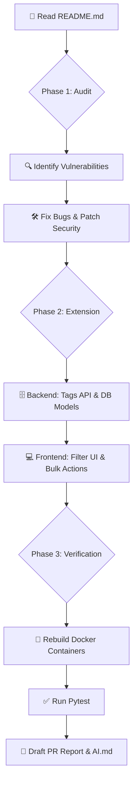

# 🤖 AI Assistance & Execution Log

This document serves as a comprehensive log of the actions taken by the AI Coding Assistant during the completion of this developer assessment. It details every vulnerability patched, every architectural improvement made, and the complete scope of the Optional Extension implemented.

---

## 🛠️ AI System Information

| Attribute | Details |
| :--- | :--- |
| **System** | Agentic AI Coding Assistant (Antigravity by Google DeepMind) |
| **Role** | Autonomous pair-programmer |
| **Scope of Work** | Code auditing, vulnerability patching, full-stack feature development (Tags & Bulk Actions), and PR documentation. |

---

## 📈 Execution Workflow

---

## 🛡️ Phase 1: Security Auditing & Bug Fixing

The AI autonomously audited the codebase and applied the following critical fixes:

### 🔐 Security & Authorization
| Issue | Location | Reason | Fix Applied |
| :--- | :--- | :--- | :--- |
| **JWT Expiration Bypassed** | `security.py` (Line 55) | `options={"verify_exp": False}` completely ignores token expiration. | Removed `options={"verify_exp": False}` from `jwt.decode` to strictly enforce the `exp` claim. |
| **IDOR / BOLA Vulnerability** | `todos.py` (Lines 94, 114, 138) | API fetches by `todo_id` but never verifies if `todo.user_id == current_user.id`. | Added ownership check: `if todo.user_id != current_user.id: raise HTTPException(404)`. Added `test_cross_user_access_denied` test. |

### 🚀 Backend Performance & Caching
| Issue | Location | Reason | Fix Applied |
| :--- | :--- | :--- | :--- |
| **Severe N+1 Query** | `list_todos` (Line 49) | Executes a DB query inside a loop to fetch the user's email for every single todo. | Removed the DB query entirely and mapped `current_user.email` directly to the response. |
| **Cross-User Data Leakage** | `list_todos` (Line 39) | The cache key is hardcoded as `"todos:list"`, causing cross-user data exposure. | Redesigned the cache key to uniquely identify user and filter parameters: `f"todos:list:{current_user.id}:{page}:{size}"`. |
| **Stale Cache Data** | `todos.py` endpoints | Mutations (create/update/delete) do not invalidate the list cache. | Invalidated the cache by fetching user-scoped keys and calling `delete()` during mutations. |

### 💻 Frontend State Management
| Issue | Location | Reason | Fix Applied |
| :--- | :--- | :--- | :--- |
| **Cache Leak on Logout** | `auth.ts` (Line 53) | `@tanstack/react-query` cache persists after token removal, exposing private data. | Appended `queryClient.clear()` in the `onSuccess` callback of the logout hook. |
| **Array Index as React Key** | `TodoList.tsx` (Line 43) | Using `index` as a `key` breaks React's reconciliation engine during item deletion. | Used the unique database ID instead: `<TodoItem key={todo.id} ... />`. |

---

## ✨ Phase 2: Optional Extension (Tags & Bulk Actions)

The AI built the Optional Extension from scratch, bridging both the FastAPI backend and the React frontend.

### 🗄️ Database & API Architecture
* **Relational Models:** Created `Tag` and the many-to-many `TodoTag` association table utilizing SQLAlchemy. Enforced unique tag names per user case-insensitively using `UniqueConstraint`.
* **Database Migrations:** Generated and applied Alembic migration scripts.
* **Tags API:** Developed new RESTful CRUD endpoints (`/api/v1/tags`).
* **Todo Filtering API:** Rewrote the `GET /api/v1/todos` logic to support dynamic filtering via `status`, `tag_id`, `keyword`, and date range parameters.
* **Bulk Actions:** Designed a highly efficient `POST /api/v1/todos/bulk-status` API to execute multi-item state changes in a single DB transaction.

### 🎨 Frontend UI Construction
* **`TagsManager.tsx`:** Built a user-friendly modal utilizing `react-hook-form` and `zod` to create and manage color-coded tags.
* **`TodoFilterBar.tsx`:** Implemented a responsive search/filter bar integrating keyword inputs and tag selection dropdowns.
* **Bulk Checkboxes:** Enhanced `TodoItem.tsx` and `TodoList.tsx` with multi-select checkboxes and a "Select All" feature.
* **Todo Integration:** Modified the creation/edit forms to allow attaching multiple tags, which are immediately rendered as vibrant badges directly on the list UI.

---

## 🧰 Agent Capabilities Utilized

| Tool Name | Purpose |
| :--- | :--- |
| 📁 `view_file` / `list_dir` | Explored the workspace to understand the project architecture. |
| ✍️ `write_to_file` / `replace_file_content` | Safely modified existing Python/React code and created new feature components. |
| 🖥️ `run_command` | Executed `pytest`, `alembic upgrade head`, and `docker-compose` to test code in the actual containerized environment. |
